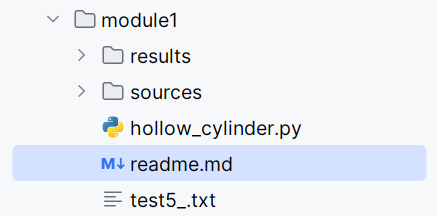

# 项目说明

项目结构示意图：
<pre>
📦 module1/
├── 📂 autoMakeFiles/
│   ├── 📜 make_in_files.py
│   ├── 📜 changeInFiles.py
│   └── 📂 results_of_in_files/
├── 📂 initial_in_files/
├── 📂 results/
│   ├── 📂 outFiles/
│   └── 📂 outPictures/
├── 📂 sources/
├── 📜 hollow_cylinder.py
├── 🖼️ img.png
└── 📜 readme.md

</pre>
（1）results文件夹下的outFiles文件夹保存了输出的merged.out文件和.txt文件。

merged.out文件可以还原回图片，用于备份；

.txt文件说实话我也没想好用来干啥，只是示例代码里都有这么一行（雾），如果觉得浪费空间其实应该是删了也没啥问题的（大嘘）；

outPictures保存了所有生成的图片，按照名字，每一个都加一个_i，其中 i 为以这个模型的名字开头的第i张图片。

**建议在每一次运行前都把outFiles和outPictures里的文件都挪走，不然这俩文件可能不会一一对应。徒增麻烦。**

（2）sources文件夹里丢了所有的.in文件；一个.h5文件；PVC.txt（介质属性）。

咳咳。显然把所有.in文件放在一个单独的文件夹是一个更加明智的选择。但……不知道为什么出现了非常牛魔的bug，于是我就开摆了，难看就难看罢（无慈悲）。

这几坨文件不要随便挪位置。

（3）hollow_cylindder.py文件是用来跑模型的核心文件：



其中的每一块我已经尽可能使之独立了，在别的电脑上跑主要就改改dmax这个参数：

```python
dmax = r"E:\GPRMAX_Simulations"  # 项目根目录
```

可能有忘了改的路径，这是我的错，但我是不会为此道歉的。摩★艾★！
（开玩笑的，调成自己电脑的路径就好）

（4）autoMakeFiles文件夹

make_in_files这个脚本是用来自动生成.in文件的。

为了保险起见，我把这些.in文件先丢到dmax\module1\autoMakeFiles\results_of_in_files，然后你再手动把这些.in文件复制到sources文件夹里。

（dmax是顶层文件的目录，如果我没有写错的话应该是唯一一个需要你手动改的参数）

运行这个程序，会让你选择是按±x、±y方向生成挪动位置，并自动计算出边界，一直生成到与边界相切为止。

这个程序可以比较容易地复用到其它模型的自动化生成中。只需改如下“模板段”：

```python
# 基础工程模板
template = """#title: B-scan from a metal cylinder and a PVC hollow cylinder buried in a dielectric half-space
#domain: 3.000 0.500 0.002
#dx_dy_dz: 0.002 0.002 0.002
#time_window: 9e-9

#material: 6 0 1 0 half_space
#material: 3.3 0 1 0 PVC

#waveform: ricker 1 1.5e9 my_ricker
#hertzian_dipole: z 0.040 0.400 0 my_ricker
#rx: 0 0.400 0
#src_steps: 0.025 0 0
#rx_steps: 0.0250 0 0

#box: 0 0 0 3.000 0.400 0.002 half_space
#cylinder: 0.500 0.100 0 0.500 0.100 0.002 0.020 pec
cylinder: 1.800 0.200 0 1.800 0.200 0.002 0.030 pec
#geometry_objects_read: {x_pos} {y_pos} 0 E:\\GPRMAX_Simulations\\module1\\sources\\hollow_cylinder.h5 E:\\GPRMAX_Simulations\\module1\\sources\\PVC.txt
"""
```

{x_pos} {y_pos}是要改动的中心位置。每次移动0.02（分辨率的10倍）。

上面是中心没有加水的。下面的是加了水柱的模板：
```python
"""#title: B-scan from a metal cylinder and a PVC hollow cylinder buried in a dielectric half-space
#domain: 3.000 0.500 0.002
#dx_dy_dz: 0.002 0.002 0.002
#time_window: 9e-9

#material: 6 0 1 0 half_space
#material: 81 0.01 1 0 water
#material: 3.3 0 1 0 PVC

#waveform: ricker 1 1.5e9 my_ricker
#hertzian_dipole: z 0.040 0.400 0 my_ricker
#rx: 0 0.400 0
#src_steps: 0.025 0 0
#rx_steps: 0.0250 0 0

#box: 0 0 0 3.000 0.400 0.002 half_space
#cylinder: {water_x} {water_y} 0 {water_x} {water_y} 0.002 0.060 water
#geometry_objects_read: {x_pos} {y_pos} 0 E:\\GPRMAX_Simulations\\module1\\sources\\hollow_cylinder.h5 E:\\GPRMAX_Simulations\\module1\\sources\\pec.txt
"""
```

这时候需要调的参数就多了两个（水柱中心的位置）。

changeInFiles.py用于解决不同设备上用changeInFiles.py的跑出来的.in文件顶层路径不同的问题。

手动修改该脚本中的以下代码段：
```python
dmax = "E:\\GPRMAX_Simulations"  # 新的顶层目录路径
old_dmax1 = "D:\\disk_f\\cxcy_gpr\\GPRMAX_Simulations"  # 需要替换的第一处旧路径
old_dmax2 = "D:\\disk_f\\cxcy_gprGPRMAX_Simulations"  # 需要替换的第二处旧路径(注意这里没有斜杠)
```

old_dmax1是原先.h5文件的顶层目录，old_dmax2是原先的材料material.txt的顶层目录（防止有人把它们放在不同的路径下）


